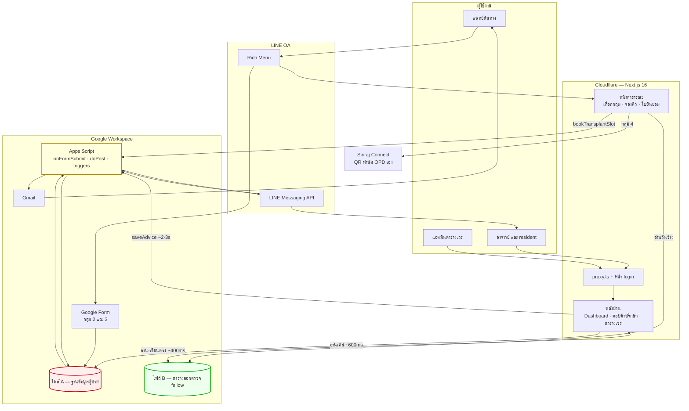
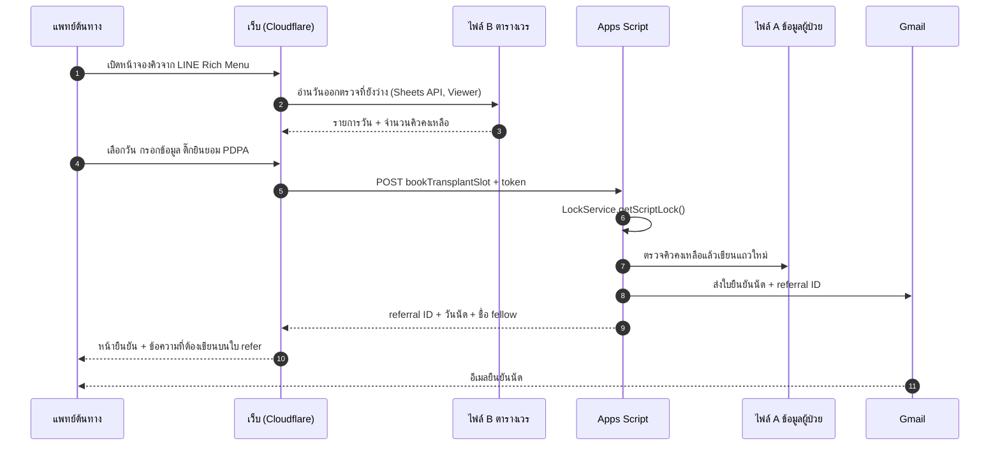
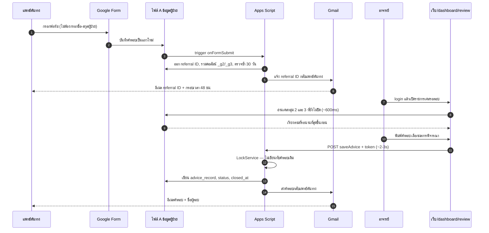
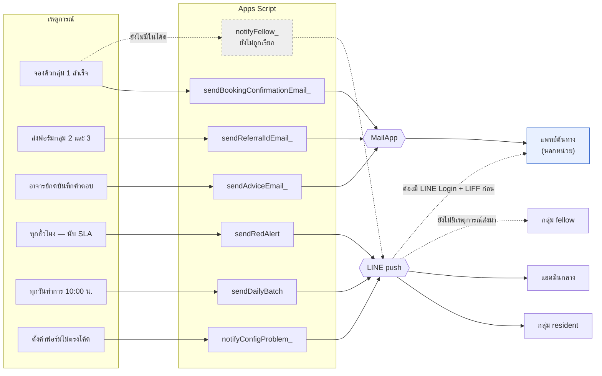

# สถาปัตยกรรมระบบส่งต่อผู้ป่วยโลหิตวิทยา ศิริราช

**เอกสารนี้อธิบายสิ่งที่โค้ดทำจริง ณ วันที่ 10 สิงหาคม 2569** ไม่ใช่สิ่งที่ตั้งใจจะทำ
จุดที่ยังทำไม่ได้ถูกทำเครื่องหมาย ⚠️ ไว้ ไม่ได้ซ่อน

ไดอะแกรมในเอกสารนี้เขียนด้วย Mermaid จึงแสดงผลได้ทันทีบน GitHub, VS Code และ Obsidian
ถ้าต้องการภาพสำหรับใส่สไลด์หรือรายงาน ใช้ไฟล์คู่กันที่เขียนด้วย diagram-as-code ของ eraser.io:

| ไฟล์ | ประเภทที่เลือกใน eraser.io |
| --- | --- |
| [architecture.eraser](architecture.eraser) | Cloud Architecture Diagram |
| [notification-flow.eraser](notification-flow.eraser) | Flowchart |

เอกสารที่เกี่ยวข้อง: [SRS.md](SRS.md) · [FORMS_AND_SHEETS.md](FORMS_AND_SHEETS.md) · [DEPLOYMENT.md](DEPLOYMENT.md) · [SETUP_GUIDE.md](SETUP_GUIDE.md)

---

## 1. ภาพรวม

ระบบแบ่งงานตาม **สิ่งที่แพทย์ต้นทางต้องการ** ไม่ใช่ตามโรค — เป็นแกนหลักที่กำหนดว่าใครรับผิดชอบและตอบกลับอย่างไร

| กลุ่ม | ต้องการอะไร | ใครจัดการ | ผ่านระบบนี้ไหม |
| --- | --- | --- | --- |
| 1 | นัดพบแพทย์ปลูกถ่ายฯ | แพทย์ต้นทางจองเอง | ✅ จองผ่านเว็บ |
| 2 | ขอความเห็นสูตรยาเคมีบำบัด | R2/R3 + อาจารย์ | ✅ Google Form |
| 3 | ขอส่งตัวมาให้ยาเคมีบำบัด | R2/R3 + อาจารย์ | ✅ Google Form |
| 4 | Refer OPD ทั่วไป | ระบบนัดหมายของโรงพยาบาล | ❌ ชี้ไป Siriraj Connect |

กลุ่ม 1 ไม่มีขั้นรอแอดมิน และกลุ่ม 4 ไม่ต้องกรอกอะไรเลย — เป็นมติอาจารย์เมื่อ 2 สิงหาคม 2569
เพื่อลดภาระแอดมินและไม่ให้ผู้ป่วยต้องเดินทางกลับไปกลับมา

---

## 2. องค์ประกอบและการเชื่อมต่อ

---

## 3. ทำไมต้องมี Google Sheet สองไฟล์

**เพราะ Google ให้สิทธิ์เป็นราย _ไฟล์_ ไม่ใช่รายแท็บ** — ไม่ใช่เรื่องความเป็นระเบียบ

ถ้าเอาตารางเวร fellow ไปไว้เป็นแท็บหนึ่งในไฟล์เดียวกับข้อมูลผู้ป่วย
การให้เว็บเขียนตารางเวรได้ จะเท่ากับให้เว็บเขียนข้อมูลผู้ป่วยได้ด้วย ไม่มีทางแยก

| | ไฟล์ A — ฐานข้อมูลผู้ป่วย | ไฟล์ B — ตารางออกตรวจ fellow |
| --- | --- | --- |
| เก็บอะไร | เคส refer ทั้งหมด | วันออกตรวจ ชื่อ fellow จำนวนคิว |
| ข้อมูลผู้ป่วย | มี (ไม่มีชื่อและ HN) | **ห้ามมีเด็ดขาด** |
| Service account ของเว็บ | **Viewer** เท่านั้น | **Editor** |
| เว็บเขียนได้ไหม | ไม่ได้ ต้องผ่าน Apps Script | ได้ตรง ๆ |
| General access | Restricted | Restricted |
| Env var | `GOOGLE_SHEET_ID` | `GOOGLE_SCHEDULE_SHEET_ID` |

ผลที่ได้: ต่อให้เว็บถูกเจาะ ผู้บุกรุกก็ยังลบหรือแก้ข้อมูลผู้ป่วยไม่ได้ เพราะ token ที่เว็บถืออยู่
ขอ scope `spreadsheets.readonly` กับไฟล์ A เท่านั้น (ดู `SCOPE_READ` ใน [src/lib/google-sheets.ts](../src/lib/google-sheets.ts))

---

## 4. ทำไมการเขียนต้องอ้อมผ่าน Apps Script

อ่านเร็ว (~600 ms) แต่เขียนช้า (~2–3 วินาที) — ความอ้อมนี้ตั้งใจ ไม่ใช่ข้อบกพร่อง

**เหตุผลที่ 1 — สิทธิ์** เว็บเป็น Viewer บนไฟล์ A จึงเขียนตรงไม่ได้เลย
Apps Script เป็น container-bound script ของไฟล์นั้น และ**รันในนามเจ้าของไฟล์ที่เป็นมนุษย์**
ไม่ใช่ service account จึงเขียนได้

**เหตุผลที่ 2 — กันจองชนกัน** Sheets REST API ทำ check-and-write ให้เป็น atomic ไม่ได้
ถ้าแพทย์สองคนกดจองคิวสุดท้ายพร้อมกัน ทั้งคู่จะอ่านเห็น "ว่าง 1" แล้วเขียนทับกัน
`LockService` มีเฉพาะใน Apps Script เท่านั้น

**ข้อยกเว้น** ตารางเวร fellow เขียนตรงผ่าน Sheets API เพราะวัดได้ว่า Apps Script Web App
ใช้เวลา 1–10 วินาทีต่อคำสั่ง (cold start) เทียบกับ Sheets API ที่ราว 400 ms
งานแอดมินกดถี่มาก ความช้าจึงสะสมจนใช้งานไม่ไหว ส่วนการจองและการตอบคำปรึกษาเกิดครั้งเดียวต่อเคส
ความช้าจึงยอมรับได้

---

## 5. เส้นทางการทำงาน

### กลุ่มที่ 1 — จองคิวเอง

ข้อความ "ส่งพบ fellow transplant ชื่อ … ที่ OPD 700" บนหน้ายืนยัน **คัดลอกได้**
เพราะพยาบาลคัดกรองด่านหน้าใช้บรรทัดนี้บรรทัดเดียวในการส่งผู้ป่วยถึงตัวแพทย์
ถ้าไม่มี ผู้ป่วยจะถูกส่งวนหาแผนกเอง

⚠️ **fellow ไม่ได้รับแจ้งในขั้นตอนนี้** ดู §7 ช่องว่างที่ 1

### กลุ่มที่ 2 และ 3 — กรอกฟอร์มแล้วรออาจารย์ตอบ

คำตอบถูกต่อท้ายด้วย `— ตอบโดย <username>` อัตโนมัติ เพราะชีตไม่มีคอลัมน์ผู้ตอบ
และการรู้ว่าใครตอบสำคัญกว่าความสวยงามของข้อความเมื่อต้องย้อนกลับมาดูทีหลัง

---

## 6. Flow การแจ้งเตือน

**อ่านภาพนี้อย่างไร:** เส้นทึบคือสิ่งที่ทำงานอยู่จริง เส้นประคือสิ่งที่ยังไม่มี
สังเกตว่า**ฝั่งอีเมลกับฝั่ง LINE ไม่เคยข้ามกันเลย** — แพทย์ต้นทางได้รับอีเมลอย่างเดียว
คนในหน่วยได้รับ LINE อย่างเดียว

| เหตุการณ์ | ช่องทาง | ปลายทาง | เนื้อหา |
| --- | --- | --- | --- |
| จองคิวกลุ่ม 1 สำเร็จ | Email | แพทย์ต้นทาง | วันนัด เวลา สถานที่ checklist |
| ส่งฟอร์มกลุ่ม 2 และ 3 | Email | แพทย์ต้นทาง | referral ID + กรอบเวลา 48 ชม. |
| อาจารย์บันทึกคำตอบ | Email | แพทย์ต้นทาง | คำตอบ + ชื่อผู้ตอบ |
| ค้างเกิน 48 ชม.ทำการ | LINE | แอดมินกลาง | referral ID กลุ่ม ชั่วโมงที่ค้าง |
| ทุกวันทำการ 10:00 น. | LINE | กลุ่ม resident | สรุปรวม ปักหมุด yellow ไว้บนสุด |
| ตั้งค่าไม่ตรงกัน | LINE | แอดมินกลาง | แจ้งทันที ไม่รอรอบ |

### กฎที่ใช้กับทุกข้อความ

- **PDPA-003** — ห้ามใส่ข้อมูลผู้ป่วยลง LINE มีได้แค่ referral ID กลุ่ม สถานะ และลิงก์
  ข้อยกเว้นเดียวคือข้อความถึง fellow ซึ่งอาจารย์อนุมัติให้ใส่เพศ อายุ และโรคได้ เพราะไม่มีชื่อและ HN แล้ว
- **กันสแปม** — ไม่มีการแจ้งเตือนนอกรอบ 10:00 น. เพื่อปกป้องเวลาเรียนของแพทย์ประจำบ้าน
  ยกเว้น Red Alert ซึ่งเป็นตาข่ายนิรภัยชั้นสุดท้าย และส่งซ้ำไม่ได้เพราะจดเวลาไว้ที่ `red_alert_sent_at`
- **ทนพัง** — ส่งอีเมลไม่สำเร็จต้องไม่ทำให้การรับเคสล้มเหลว ทุกจุดจึงจับ error แล้วเขียน log แทนการโยนต่อ
- **ยังไม่ตั้งค่า** — ถ้าไม่มี `LINE_CHANNEL_ACCESS_TOKEN` ระบบเขียน log แทนการส่ง
  เพื่อให้ทดสอบทั้งระบบได้ก่อนมี LINE OA จริง

---

## 7. ⚠️ ช่องว่างที่ยังไม่ได้ปิด

### ช่องว่างที่ 1 — fellow ไม่รู้ว่ามีคนจองคิวมาพบ

`notifyFellow_` ใน [apps-script/Notify.gs:132](../apps-script/Notify.gs) เขียนเสร็จแล้วทั้งข้อความ
แต่ `grep -rn "notifyFellow_" apps-script/` ทั้งโปรเจกต์ไม่พบที่ไหนเรียกใช้เลย

`bookTransplantSlot_` เขียนคิวลงชีตแล้วส่งอีเมลให้แพทย์ต้นทางแล้วจบ **fellow จึงต้องเปิดชีตหรือ dashboard ดูเอง**

นอกจากนี้ `notifyFellow_` อ่าน `referral['appointment_note']` ซึ่งเป็นชื่อคอลัมน์ที่เส้นทางการจองไม่ได้เขียน
ถ้าต่อสายตรง ๆ ข้อความจะเต็มไปด้วยขีด `-` ต้องแก้ชื่อฟิลด์ให้ตรงกับ `BOOKING_COLUMNS` ด้วย

### ช่องว่างที่ 2 — LINE ส่งถึงแพทย์ต้นทางรายบุคคลไม่ได้

`pushLineMessage_` ส่งไปที่ Script Property `LINE_TARGET_RESIDENT` / `_ADMIN` / `_FELLOW`
ซึ่งทั้งหมดเป็น **group ID** — ไม่มีปลายทางไหนเป็นบุคคลภายนอกหน่วย

LINE push ต้องรู้ `userId` ของปลายทาง แต่ระบบไม่มีทางรู้ว่า LINE บัญชีไหนเป็นเจ้าของเคสไหน
เพราะฟอร์มไม่ได้ถาม และถามก็ไม่ได้ (คนกรอกไม่รู้ `userId` ตัวเอง)

**เรื่องนี้ขัดกับข้อเท็จจริงที่อาจารย์ระบุไว้** ว่าแพทย์ไทยใช้ LINE เป็นหลักและไม่ค่อยเปิดอีเมล
แต่ตอนนี้แพทย์ต้นทางได้รับอีเมลอย่างเดียว และอีเมลมาจากช่อง "อีเมล (ไม่บังคับ)"
ถ้าเว้นว่างไว้จะไม่ได้รับอะไรเลย ต้องโทรแจ้ง

**ทางแก้:** เพิ่ม LINE Login + LIFF ภายใต้ Provider เดียวกับ Messaging API
ให้แพทย์กดจองผ่าน LIFF แล้วเก็บ `userId` ผูกกับ referral ID

### รายการอื่นที่ยังค้าง

- ยังไม่ได้ deploy ขึ้น Cloudflare — ต้องติดตั้ง `@opennextjs/cloudflare` + `wrangler` และสร้าง `wrangler.jsonc`
- ยังไม่ได้ตั้ง WAF rate limiting ที่หน้า `/login`
- `HOSPITAL_APPOINTMENT.lineOaUrl` ยังเป็น `null` — รอ URL จริงของ LINE "Siriraj นัดหมาย"
- `central_admin_backup_name` ในชีต `config` ยังว่าง — รอชื่อผู้สำรองจากอาจารย์

---

## 8. ความปลอดภัยและ PDPA

**ข้อมูลที่ระบบไม่เก็บที่ใดเลย** — ชื่อ-สกุลผู้ป่วย, เลข HN, เลขบัตรประชาชน, วันเกิดเต็ม
ฟอร์มไม่ถาม หน้าเว็บเตือนห้ามกรอก และไม่มีคอลัมน์รองรับในชีต

| ชั้น | มาตรการ |
| --- | --- |
| ไฟล์ Google Sheet | General access = Restricted แชร์เป็นรายอีเมล **ห้าม "anyone with link"** |
| Service account | Viewer บนไฟล์ A · Editor บนไฟล์ B เท่านั้น |
| หลังบ้าน | username + password จาก `DASHBOARD_USERS` · session cookie ลงลายเซ็น HMAC อายุ 12 ชม. |
| Server Action | เรียก `requireSession()` ทุกจุด ไม่พึ่ง `proxy.ts` เพราะ Server Action ถูกยิง POST ตรงได้ |
| Apps Script Web App | deploy แบบ Anyone (LINE ต้องเรียกได้) แต่ทุกคำสั่งต้องมี token ที่เทียบแบบ timing-safe |
| ความยินยอม | สองชั้น — แพทย์ต้นทางติ๊กรับรองในระบบ ต้นฉบับที่ผู้ป่วยลงนามเก็บไว้ที่โรงพยาบาลต้นทาง |
| การเก็บรักษา | `anonymizeExpired` ถอดตัวตนข้อมูลเก่าเป็นรายเดือน เก็บเฉพาะสถิติไว้ในชีต `library` |

**สิ่งที่ห้ามทำเด็ดขาด**

- ห้ามยกสิทธิ์ service account บนไฟล์ A ขึ้นเป็น Editor
- ห้ามใส่ข้อมูลผู้ป่วยลงไฟล์ B เพราะเว็บเขียนไฟล์นั้นได้
- ห้าม commit `.env.local`, `.env` หรือไฟล์ JSON ของ service account
- repository ต้องเป็น private เสมอ

---

## 9. หมายเหตุสำหรับผู้ดูแลระบบ

**Next.js 16** เปลี่ยนชื่อ `middleware.ts` เป็น `proxy.ts` แล้ว
และเอกสาร Next ระบุชัดว่า proxy เป็นแค่ด่านคัดกรองหยาบ ๆ ไม่ใช่ระบบ authorization
— การตรวจสิทธิ์จริงต้องอยู่ในทุกหน้าและทุก Server Action

**Apps Script มี global scope เดียวทั้งโปรเจกต์** ฟังก์ชันชื่อซ้ำในคนละไฟล์จะทับกันเงียบ ๆ ไม่ฟ้อง error
เคยเกิดกับ `ensureColumns_` มาแล้วครั้งหนึ่ง และทำให้ทุกการส่งฟอร์มหยุดทำงานโดยไม่มีใครรู้

**แก้โค้ด Apps Script แล้วต้อง deploy เวอร์ชันใหม่เสมอ**
`Deploy → Manage deployments → ✏️ → Version: New version → Deploy` (URL ไม่เปลี่ยน)
ถ้ากด "New deployment" จะได้ URL ใหม่ ต้องไปแก้ `.env.local` และ LINE Webhook ตามอีก

ตรวจว่า deploy ติดจริงโดยเปิด `BOOKING_API_URL` ในเบราว์เซอร์ แล้วดูบรรทัด `version:`
ซึ่งอ่านจากค่า `API_VERSION` ใน [apps-script/Api.gs](../apps-script/Api.gs) — **แก้ค่านี้ทุกครั้งที่แก้ไฟล์ ไม่งั้นมันโกหก**

**Google Form เขียนทับ header ของชีตที่ผูกไว้** ด้วยข้อความคำถามทุกครั้งที่แก้ฟอร์ม
ต้องรัน `restoreFormHeaders()` หลังแก้ฟอร์มเสมอ

**Google Sheet ปฏิเสธ `deleteColumn` บนคอลัมน์ที่ผูกกับฟอร์ม** จึงใช้วิธีซ่อนแทนลบ
ซึ่งย้อนกลับได้ด้วย `showAllColumns()`
